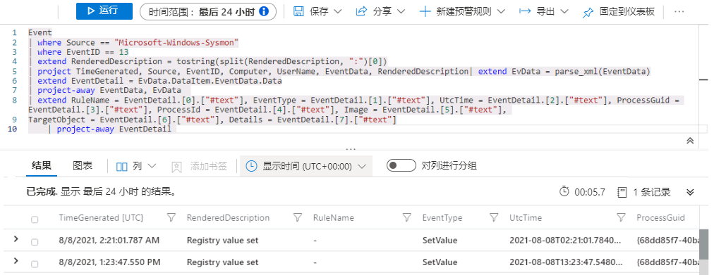

# 模块 7 - 实验室 1 - 练习 6 - 创建检测

### 任务 1：使用 Sysmon 检测攻击 1

在此任务中，你将在安装了安全事件连接器和 Sysmon 的主机上创建针对**攻击 1** 的检测。

1. 使用以下密码以管理员身份登录到 WIN1 虚拟机： **Pa55w.rd**。  

2. 在 Microsoft Edge 浏览器中，导航到 Azure 门户 (https://portal.azure.com)。

3. 在“**登录**”对话框中，复制粘贴实验室托管提供者为管理员提供的租户电子**邮件帐户**，然后选择“**下一步**”。

4. 在“**输入密码**”对话框中，复制粘贴实验室托管提供者为管理员提供的**租户密码**，然后选择“**登录**”。

5. 在 Azure 门户的搜索栏中，键入“*Sentinel*”，然后选择“**Azure Sentinel**”。

6. 选择之前创建的 Azure Sentinel 工作区。

7. 从“常规”部分选择“**日志**”。

8. 首先需要查看存储数据的位置。原因是你刚刚执行了攻击。  将日志时间范围设置为“**过去 24 小时**”。

9. 运行以下 KQL 语句

```KQL
search "temp\\startup.bat"
```

10. 针对 3 个不同的表显示结果：
    - DeviceProcessEvents
    - DeviceRegistryEvents
    - Event

    “*设备*”表来自 Defender for Endpoint 连接器，“*事件*”表填充了通过代理配置连接的 Sysmon/Operational Windows 事件日志中的数据。

    我们将接收来自两个不同源（Sysmon 和 Defender for Endpoint）的数据，因此需要生成两个之后可联合的 KQL 语句。初次调查时，你将分别查看每份数据。

    **备注**：在极少数情况下，数据加载过程可能耗时比平时的长。发生这种情况时，这些表可能在几个小时内都不会出现在查询中。如果只看到“*事件*”表，现在可以继续。

11. 第一个数据源是 Windows 主机中的 Sysmon。  运行以下 KQL 语句。

```KQL
search in (Event) "temp\\startup.bat"
```
现在仅显示 Event 表的结果。  

12. 展开各行可查看与记录相关的所有列。  一些字段（例如 EventData 和 ParameterXml）具有多个存储为结构化数据的数据项。  这使得很难对特定字段进行查询。  

13. 接下来，我们需要生成一个可分析每行中数据的 KQL 语句，从而得到有意义的字段。在 GitHub 上的 Azure Sentinel 社区中，“分析程序”文件夹中提供了很多分析程序示例。  在浏览器中打开另一个标签页，然后导航到： **https://github.com/Azure/Azure-Sentinel**

14. 选择“**分析程序**”文件夹，然后选择“**Sysmon**”文件夹。

15. 选择要查看的 Sysmon-v12.0.txt 文件。

在文件顶部，你会看到一个 Let 语句，它用于查询 Event 表并存储到名为 EventData 的变量中。
**提示**：下面的代码片段便于你更好地了解步骤 16 中的查询，它不会被复制和执行。

```
let EventData = Event
| where Source == "Microsoft-Windows-Sysmon"
| extend RenderedDescription = tostring(split(RenderedDescription, ":")[0])
| project TimeGenerated, Source, EventID, Computer, UserName, EventData, RenderedDescription
| extend EvData = parse_xml(EventData)
| extend EventDetail = EvData.DataItem.EventData.Data
| project-away EventData, EvData  ;
```

在文件的稍后部分，你会再看到一个 Let 语句，它显示 EventID == 13 并将 EventData 变量用作输入。  
**提示**：下面的代码片段便于你更好地了解步骤 16 中的查询，它不会被复制和执行。

```
let SYSMON_REG_SETVALUE_13=()
{
    let processEvents = EventData
    | where EventID == 13
    | extend RuleName = EventDetail.[0].["#text"], EventType = EventDetail.[1].["#text"], UtcTime = EventDetail.[2].["#text"], ProcessGuid = EventDetail.[3].["#text"], 
    ProcessId = EventDetail.[4].["#text"], Image = EventDetail.[5].["#text"], TargetObject = EventDetail.[6].["#text"], Details = EventDetail.[7].["#text"]
    | project-away EventDetail  ;
    processEvents;
    
};
```
看起来开局不错。

16. 通过上面的两个语句，你可创建自己的 KQL 语句，使用 Sysmon 在“事件”表中显示所有“注册表项设置值”行。运行以下 KQL 查询：

**重要提示：** 请先在*记事本*中粘贴任何 KQL 查询，然后从这里复制到“*新查询 1*”日志窗口，以避免出现任何错误。

```KQL
Event
| where Source == "Microsoft-Windows-Sysmon"
| where EventID == 13
| extend RenderedDescription = tostring(split(RenderedDescription, ":")[0])
| project TimeGenerated, Source, EventID, Computer, UserName, EventData, RenderedDescription
| extend EvData = parse_xml(EventData)
| extend EventDetail = EvData.DataItem.EventData.Data
| project-away EventData, EvData  
| extend RuleName = EventDetail.[0].["#text"], EventType = EventDetail.[1].["#text"], UtcTime = EventDetail.[2].["#text"], ProcessGuid = EventDetail.[3].["#text"], 
    ProcessId = EventDetail.[4].["#text"], Image = EventDetail.[5].["#text"], TargetObject = EventDetail.[6].["#text"], Details = EventDetail.[7].["#text"]
    | project-away EventDetail 
```

   

17. 可从这里继续生成检测规则，但该 KQL 语句似乎可在其他检测规则的 KQL 语句中重复使用。  在“日志”窗口中，选择“**保存**”，然后选择“**保存为函数**”。在“保存”飞出式窗格中，输入以下信息并保存函数：

    函数名称：Event_Reg_SetValue 
    类别：Sysmon

18. 选择“**保存**”，再选择“+”符号打开新的“日志查询”选项卡。然后运行以下 KQL 语句：

```KQL
Event_Reg_SetValue
```
根据当前的数据集合，你可接收多个行。  这在预料之中。  下一个任务是筛选特定方案。

19. 运行以下 KQL 语句：

```KQL
Event_Reg_SetValue | search "startup.bat"
```
这将返回特定记录，我们现可查看数据，了解我们可更改哪些内容来标识行。

20. 通过威胁情报，我们了解到威胁参与者正在使用 reg.exe 添加注册表项。  目录为 c:\temp。可将 startup.bat 改为其他名称。运行以下脚本

```KQL
Event_Reg_SetValue 
| where Image contains "reg.exe"

```
这是一个不错的开始。  接下来，你需要仅根据 c:\temp 目录的内容返回结果。

21. 然后输入以下 KQL 语句：

```KQL
Event_Reg_SetValue 
| where Image contains "reg.exe"
| where Details startswith "C:\\TEMP"
```

这个检测规则看起来不错。  

22. 请务必尽可能多地提供关于警报的上下文，为安全运营分析师提供帮助。这包括投影在调查关系图中使用的实体。  运行以下查询：

```KQL
Event_Reg_SetValue 
| where Image contains "reg.exe"
| where Details startswith "C:\\TEMP"
| extend timestamp = TimeGenerated, HostCustomEntity = Computer, AccountCustomEntity = UserName

```

23. 现在已准备好了检测规则，在包含查询的日志窗口中，选择命令栏中的“**+ 新建警报规则**”，然后选择“**创建 Azure Sentinel 警报**”。

24. 这会启动分析规则向导。  在“常规”选项卡中，输入：

    名称：Sysmon Startup RegKey
    描述：c:\temp 中的 Sysmon Startup Regkey
    策略：永久性
    严重性：高

选择“**下一步: 设置规则逻辑 >**”。

25. 在“**设置规则逻辑**”选项卡上，应该已填充了“**规则查询**”。选择“**->使用当前数据测试**”，检查按照当前配置每天可收到的警报数量。

26. 对于“查询计划”，设置如下：

- 运行查询的时间间隔：5 分钟
- 查看最近多久的数据：1 天

**备注**：我们特意针对同一数据生成了多个事件。这样，实验室就可使用这些警报。由于此配置更改，收到的警报数量可能会更改。  选择“**->使用当前数据测试**”，检查按照更改后的配置每天可收到的警报数量。

27. 将其余选项保留为默认值。  选择“**下一步: 事件设置 >**”按钮。

28. 对于“*事件设置(预览)*”选项卡，确保这些配置设置如下： 

- 事件设置：已启用
- 警报分组：已禁用

选择“**下一步: 自动响应 >**”按钮。

29. 对于“自动响应”选项卡，设置如下：

- 选择“*PostMessageTeams-OnAlert*”

选择“**下一步: 查看**”按钮。

30. 在“查看”选项卡中，选择“**创建**”按钮。

### 任务 2：使用 Defender for Endpoint 检测攻击 1

在此任务中，你将在配置了 Microsoft Defender for Endpoint 的主机上创建针对**攻击 1** 的检测。

1. 在 Azure Sentinel 门户中，从“常规”部分选择“**日志**”。

2. 首先需要查看存储数据的位置。原因是你刚刚执行了攻击。  

    将日志时间范围设置为“过去 24 小时”。

3. 运行以下 KQL 语句：

```KQL
search "temp\\startup.bat"
```

4. 针对 3 个不同的表显示结果：
    DeviceProcessEvents
    DeviceRegistryEvents
    Event

    “设备”表来自 Defender for Endpoint 连接器，“**事件**”表填充了通过代理配置连接的 Sysmon/Operational Windows 事件日志中的数据。

    我们将接收来自两个不同源（Sysmon 和 Defender for Endpoint）的数据，  因此我们需要生成两个之后可联合的 KQL 语句。但在初次调查时，你将分别查看每份数据。

    **备注**：在极少数情况下，数据加载过程可能耗时比平时的长。发生这种情况时，这些表可能在几个小时内都不会出现在查询中。如果在结果中没有看到“*设备*”表，请继续执行任务 3，稍后再回到此处。

5. 此检测将重点关注来自 Defender for Endpoint 的数据。  运行以下 KQL 语句：

```KQL
search in (Device*) "temp\\startup.bat"
```

6. DeviceRegistryEvents 表中的数据已经规范化，便于进行查询。  展开各行可查看与记录相关的所有列。

7. 通过威胁情报，我们了解到威胁参与者正在使用 reg.exe 添加注册表项。  目录为 c:\temp。可将 startup.bat 改为其他名称。  输入此 KQL 语句：

```KQL
DeviceRegistryEvents
| where ActionType == "RegistryValueSet"
| where InitiatingProcessFileName == "reg.exe"
| where RegistryValueData startswith "c:\\temp"
```

这个检测规则看起来不错。  

8. 请务必尽可能多地提供关于警报的上下文，为安全运营中心分析师提供帮助。这包括投影在调查关系图中使用的实体。运行以下查询：

```KQL
DeviceRegistryEvents
| where ActionType == "RegistryValueSet"
| where InitiatingProcessFileName == "reg.exe"
| where RegistryValueData startswith "c:\\temp"
| extend timestamp = TimeGenerated, HostCustomEntity = DeviceName, AccountCustomEntity = InitiatingProcessAccountName
```

   

9.  现在已准备好了检测规则，在包含查询的日志窗口中，选择命令栏中的“**+ 新建警报规则**”。  然后选择“**创建 Azure Sentinel 警报**”。

10. 这会启动分析规则向导。  在“常规”选项卡中，输入：

    名称：D4E Startup RegKey
    描述：c:\temp 中的 D4E Startup Regkey
    策略：永久性
    严重性：高

11. 选择“**下一步: 设置规则逻辑 >**”按钮。

12. 在“设置规则逻辑”选项卡上，应该已填充了“**规则查询**”。

13. 对于“查询计划”，设置以下项：

- 运行查询的时间间隔：5 分钟
- 查看最近多久的数据：1 天

**备注**：我们特意针对同一数据生成了多个事件。  这样，实验室就可使用这些警报。

14. 将其余选项保留为默认值。  选择“**下一步: 事件设置 >**”：

15. 对于“*事件设置(预览)*”，设置如下： 

- 事件设置：已启用
- 警报分组：已禁用

选择“**下一步: 自动响应 >**”。

16. 对于“自动响应”选项卡，设置以下项：

- 选择“*PostMessageTeams-OnAlert*”

选择“**下一步: 查看**”。

17. 在“查看 + 创建”选项卡上，选择“**创建**”。

### 任务 3：使用 SecurityEvent 检测攻击 2

在此任务中，你将在安装了安全事件连接器和 Sysmon 的主机上创建针对*攻击 2* 的检测。

1. 从 Azure Sentinel 门户的“常规”部分选择“**日志**”。

2. 首先需要查看存储数据的位置。原因是你刚刚执行了攻击。  

    将日志时间范围设置为“过去 24 小时”。

3. 运行以下 KQL 语句：

```KQL
search "administrators"
```

4. 结果显示以下表的内容：
    Event
    SecurityEvent

5. 第一个数据源是 SecurityEvent。现在调查 Windows 使用哪个事件 ID 来确定正在向特权组添加成员。我们要查看的 EventID 和事件是“4732 - 一名成员被添加到启用了安全性的本地组”。执行以下脚本进行确认：

```KQL
SecurityEvent
| where EventID == "4732"
| where TargetAccount == "Builtin\\Administrators"

```

6. 展开各行可查看与记录相关的所有列。  我们要查找的用户名未显示。  问题在于未存储该用户名，存储的是安全标识符 (SID)。  以下 KQL 将尝试匹配 SID，以填充已添加到管理员组的 TargetUserName。

```KQL
SecurityEvent
| where EventID == "4732"
| where TargetAccount == "Builtin\\Administrators"
| extend Acct = MemberSid, MachId = SourceComputerId 
| join kind=leftouter (
     SecurityEvent 
     | summarize count() by TargetSid, SourceComputerId, TargetUserName
     | project Acct1 = TargetSid, MachId1 = SourceComputerId, UserName1 = TargetUserName
) on $left.MachId == $right.MachId1, $left.Acct == $right.Acct1 

```

这个检测规则看起来不错。  

   

**备注**：实验室使用的数据集较小，因此该 KQL 可能不会返回预期结果。

7. 请务必尽可能多地提供关于警报的上下文，为安全运营分析师提供帮助。这包括投影在调查关系图中使用的实体。  运行以下查询：

```KQL
SecurityEvent
| where EventID == "4732"
| where TargetAccount == "Builtin\\Administrators"
| extend Acct = MemberSid, MachId = SourceComputerId 
| join kind=leftouter (
     SecurityEvent 
     | summarize count() by TargetSid, SourceComputerId, TargetUserName
     | project Acct1 = TargetSid, MachId1 = SourceComputerId, UserName1 = TargetUserName
) on $left.MachId == $right.MachId1, $left.Acct == $right.Acct1 
| extend timestamp = TimeGenerated, HostCustomEntity = Computer, AccountCustomEntity = UserName1
```

8. 现在已准备好了检测规则，在包含该查询的日志窗口中，选择命令栏中的“**+ 新建警报规则**”，然后选择“**创建 Azure Sentinel 警报**”。

9. 这会启动分析规则向导。  在“常规”选项卡中，输入：

- 名称： SecurityEvents Local Administrators User Add 
- 描述：SecurityEvents 本地管理员用户添加操作 
- 策略：特权提升
- 严重性：高

选择“**下一步: 设置规则逻辑 >**”按钮。

10. 在“设置规则逻辑”选项卡上，应该已填充了“规则查询和映射实体”。

11. 对于“查询计划”，设置如下：

- 运行查询的时间间隔：5 分钟
- 查看最近多久的数据：1 天

**备注**：我们特意针对同一数据生成了多个事件。  这样，实验室就可使用这些警报。

12. 将其余选项保留为默认值。  选择“**下一步: 事件设置 >**”：

13. 对于“*事件设置(预览)*”，设置如下：

- 事件设置：已启用
- 警报分组：已禁用

选择“**下一步: 自动响应 >**”

14. 对于“自动响应”选项卡，设置以下项：

- 选择“**PostMessageTeams-OnAlert**”。

选择“**下一步: 查看 >**”按钮。

15. 在“查看”选项卡中，选择“**创建**”。

## 转到练习 7
