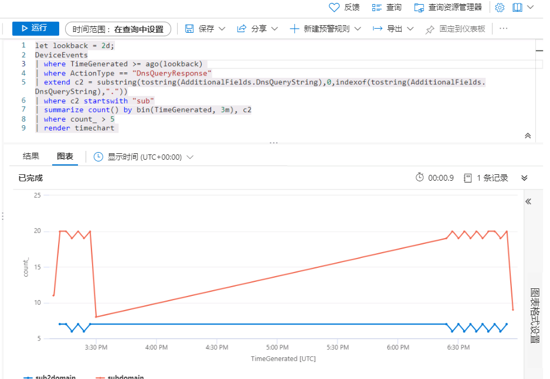
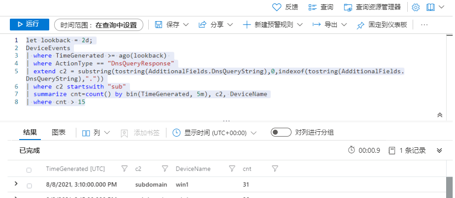

# 模块 8 - 实验室 1 - 练习 1 - 在 Azure Sentinel 中执行威胁搜寻

## 实验室场景

你是一位安全运营分析师，你所在公司已实现 Azure Sentinel。你收到了关于命令和控制 (C2) 技术的威胁情报。  你需要执行搜寻并监视威胁。

**请注**意，本实验室使用的日志数据是在本课程的上一个模块中创建的。  

**请注**意，你已在上一模块中体验过探索数据的过程，因此本实验室提供 KQL 语句供你开始操作。  

### 任务 1：创建搜寻查询

在此任务中，你将创建搜寻查询、为结果添加书签并创建 Livestream。

1. 使用以下密码以管理员身份登录到 WIN1 虚拟机：**Pa55w.rd**。  

2. 在 Edge 浏览器中，通过 https://portal.azure.com 导航到 Azure 门户。

3. 在 **“登录”** 对话框中，复制粘贴实验室托管提供者提供的**租户电子**邮件帐户，然后选择 **“下一步”**。

4. 在 **“输入密码”** 对话框中，复制粘贴实验室托管提供者提供的**租户密码**，然后选择 **“登录”**。

5. 在 Azure 门户的搜索栏中，键入 *Sentinel*，然后选择 **“Azure Sentinel”**。

6. 选择 Azure Sentinel 工作区。

7. 选择 **“日志”** 

8. 在新查询 1 区域输入以下 KQL 语句：

```KQL
let lookback = 2d;
DeviceEvents
| where TimeGenerated >= ago(lookback) 
| where ActionType == "DnsQueryResponse"
| extend c2 = substring(tostring(AdditionalFields.DnsQueryString),0,indexof(tostring(AdditionalFields.DnsQueryString),"."))
| where c2 startswith "sub"
| summarize count() by bin(TimeGenerated, 3m), c2
| where count_ > 5
| render timechart 
```

   

9. 该语句是为了提供一个可视化效果，用于在一致基础上检查 C2 信标输出。  花点时间将“3 分钟”设置调整为 30 秒或更长时间。  将 count_ > 5 设置更改为其他阈值计数来观察影响。

10. 你现已确定要向 C2 服务器发送信标的 DNS 请求。  接下来，请确定要发送信标的设备。  输入以下 KQL 语句：

```KQL
let lookback = 2d;
DeviceEvents
| where TimeGenerated >= ago(lookback) 
| where ActionType == "DnsQueryResponse"
| extend c2 = substring(tostring(AdditionalFields.DnsQueryString),0,indexof(tostring(AdditionalFields.DnsQueryString),"."))
| where c2 startswith "sub"
| summarize cnt=count() by bin(TimeGenerated, 5m), c2, DeviceName
| where cnt > 15
```
   

**备注**：生成的日志数据仅来自一台设备。

11. 在 Azure Sentinel 门户的“威胁管理”区域中选择 **“搜寻”** 页面。

12. 从命令栏中选择 **“+ 新建查询”**。

13. 对于 **“自定义查询”**，输入以下 KQL 语句：

```KQL
let lookback = 2d;
DeviceEvents
| where TimeGenerated >= ago(lookback) 
| where ActionType == "DnsQueryResponse"
| extend c2 = substring(tostring(AdditionalFields.DnsQueryString),0,indexof(tostring(AdditionalFields.DnsQueryString),"."))
| where c2 startswith "sub"
| summarize cnt=count() by bin(TimeGenerated, 5m), c2, DeviceName
| where cnt > 15
```

14. 对于名称，输入 *“C2 搜寻”* 类型

15. 对于实体映射，输入：

    对于主机，选择 **“DeviceName”**，然后选择 **“添加”**。
    对于时间戳，选择 **“TimeGenerated”**，然后选择 **“添加”**。

16. 选择 **“创建”**。

17. 在“Azure Sentinel | 搜寻”边栏选项卡中，在列表中搜索刚刚创建的查询 *“C2 搜寻”*。

18. 在列表中选择 **“C2 搜寻”**。

19. 选择页面右侧的 **“运行查询”** 按钮。

20. 结果计数显示在弹出窗口顶部。

21. 选择 **“查看结果”** 按钮。

22. 选择结果中的第一行。 

23. 选择 **“添加书签”** 按钮。

24. 在“添加书签”飞出式窗口中，在出现的窗格中选择 **“创建”**。

25. 返回到 Azure Sentinel 门户中的“搜寻”页面（提示：向左滚动）。

26. 选择 **“书签”** 选项卡。

27. 选择刚刚在结果列表中创建的书签。

28. 在飞出式窗格中，选择 **“调查”** 按钮。

29. 浏览调查图。

30. 返回到 Azure Sentinel 门户中的“搜寻”页面。

31. 选择 **“查询”** 选项卡

32. 选择 **“C2 搜寻”** 查询。

33. 选择该行末尾的 **...**，打开上下文菜单。

34. 选择 **“添加到 livestream”**。

# 继续进行练习 2
